# Gully Legends Prague Match Scoring User Manual

Version 1.1 - August 2026

This manual is the source guide for admins and scorers using the Gully Legends Prague match-management and Quick Scoring workflow. It explains how to create a match, assign teams, score a live gully cricket match, manage innings changes, review Player of the Match, and read the final scorecard.

The screenshots were created using a **Demo Test Match**. No real match data was modified.

Version 1.1 documents Batting Mode, Single Batter Mode, Last Batter Solo, the explicit first-innings break, Start Second Innings, the improved Live Result Preview, and autosave/recovery guidance.

## 1. Create A Match

Open **MATCHES** from the navbar, then choose the create-match flow. A new match starts as **CREATE MATCH** with the fixed venue:

**CZU Gully Arena - Open Field, Prague**

The first screen shows the match status, Live Result Preview, Phase 1 Match Setup, and the setup sections used before scoring starts.

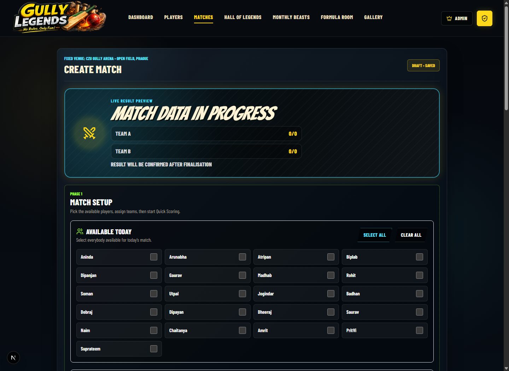

*Figure 1. Create Match overview before players and settings are completed.*

## 2. Select Available Today

Use **Available Today** to mark only the players who are actually present for the match.

1. Tick every player who is available today.
2. Use **Select All** only when everyone on the roster is available.
3. Use **Clear All** if you need to restart the availability list.
4. Continue to Team Assignment after the playing group is correct.

Only players marked here can appear in Team Assignment. This keeps match setup clean and prevents unavailable players from entering the scoring workflow.

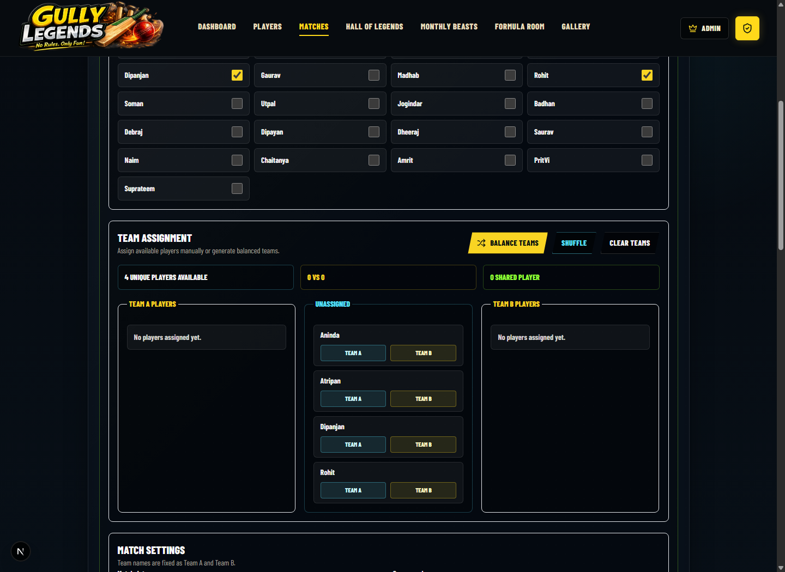

*Figure 2. Available Today controls for choosing the day's playing group.*

## 3. Assign Teams

Team names are fixed as **Team A** and **Team B**.

Manual assignment uses three clear areas:

- **Team A Players**
- **Unassigned**
- **Team B Players**

A normal player appears in only one place. When you assign a player to Team A or Team B, that player leaves Unassigned. Use **Remove** to send a player back to Unassigned before placing them somewhere else.

1. Start from the **Unassigned** column.
2. Choose **Team A** or **Team B** for each available player.
3. Check that Unassigned is empty before starting the match.
4. Use **Remove** if a player needs to move to the other team.

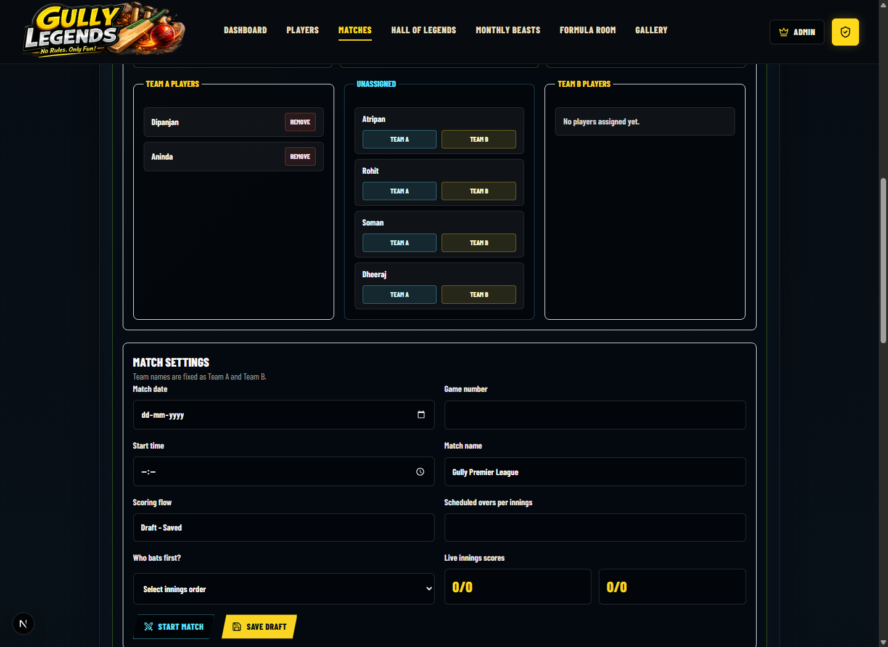

*Figure 3. Manual Team Assignment with assigned and unassigned players separated.*

## 4. Balance, Shuffle And Clear Teams

Use **Balance Teams** to automatically split the available players into two teams.

Use **Shuffle** to generate another balanced team combination.

Use **Clear Teams** to keep the same Available Today list but move everyone back to Unassigned.

For odd attendance, use the existing **Shared Player** option when the app asks for it. A Shared Player is the intentional exception who may represent both teams.

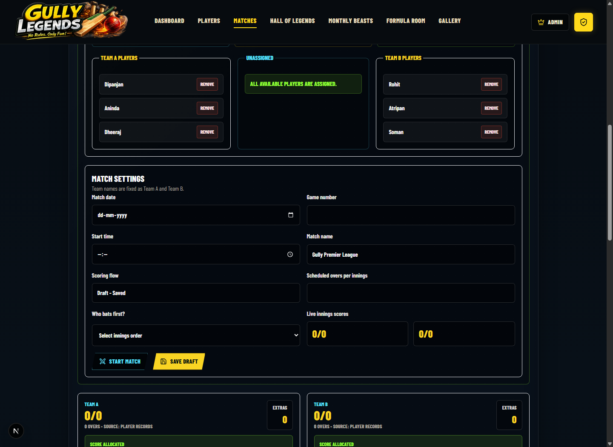

*Figure 4. Balanced teams with Unassigned empty.*

## 5. Match Settings

Complete the required match details before starting scoring:

- **Match date**
- **Game number**
- **Start time**
- **Match name**
- **Scheduled overs per innings**
- **Who bats first?**
- **Batting Mode**

Batting Mode is mandatory before **Start Match**.

### Two Batters - Striker + Non-striker

Use when two active batters will play at the same time.

### Single Batter - One active batter

Use when only one batter will play at a time.

If Batting Mode or another required setting is missing, **Start Match** keeps the match in setup mode and shows inline validation.

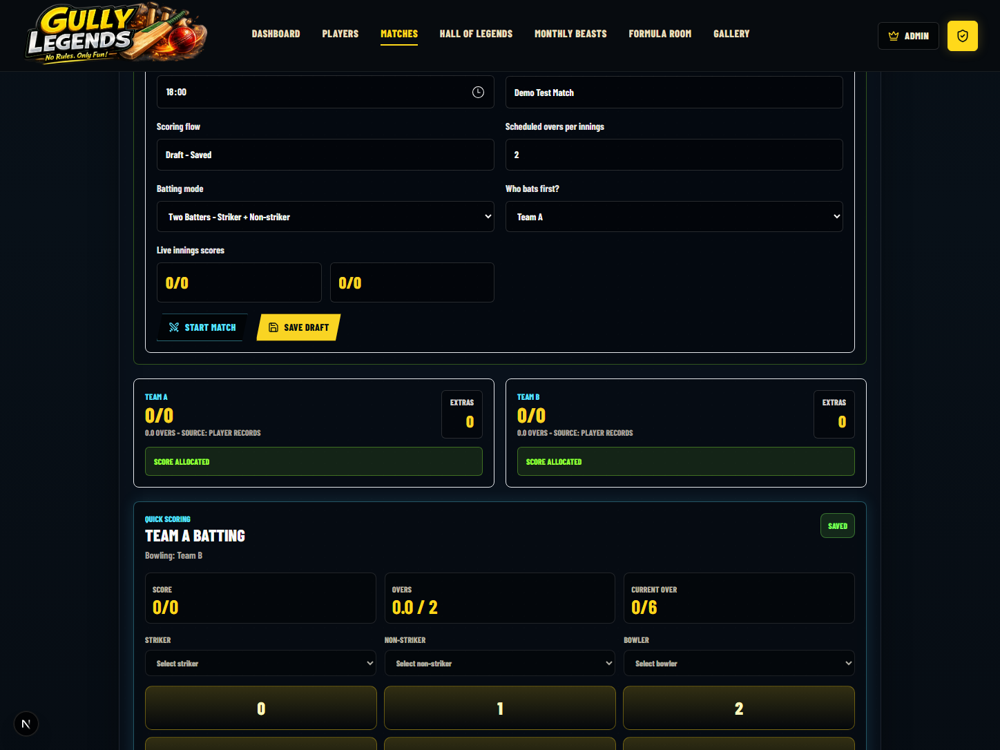

*Figure 5. Match Settings with Batting Mode, innings order and scheduled overs.*

## 6. Setup Validation

If required setup information is missing, **Start Match** keeps the match in setup mode and shows validation messages.

Fix every highlighted item before starting Quick Scoring.

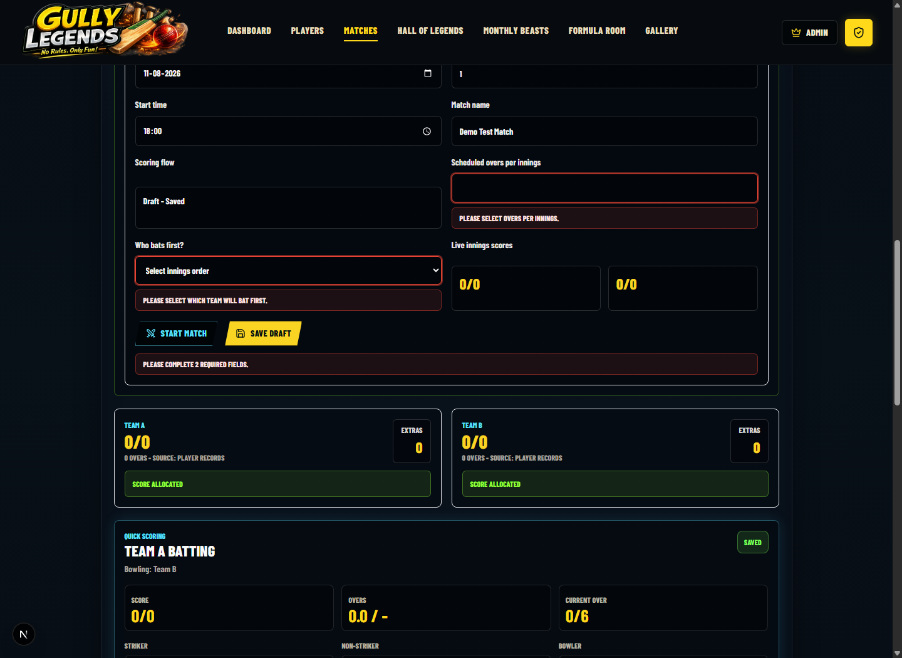

*Figure 6. Setup validation prevents incomplete matches from starting.*

## 7. Setup Locked

After a match starts, setup becomes locked and the page changes to **LIVE MATCH ENTRY**.

The compact locked setup includes:

- Team A player count
- Team B player count
- scheduled overs
- batting-first team
- selected Batting Mode

**Edit Setup** is available only before the first recorded delivery. After scoring begins, teams, scheduled overs, batting-first team and Batting Mode cannot be changed.

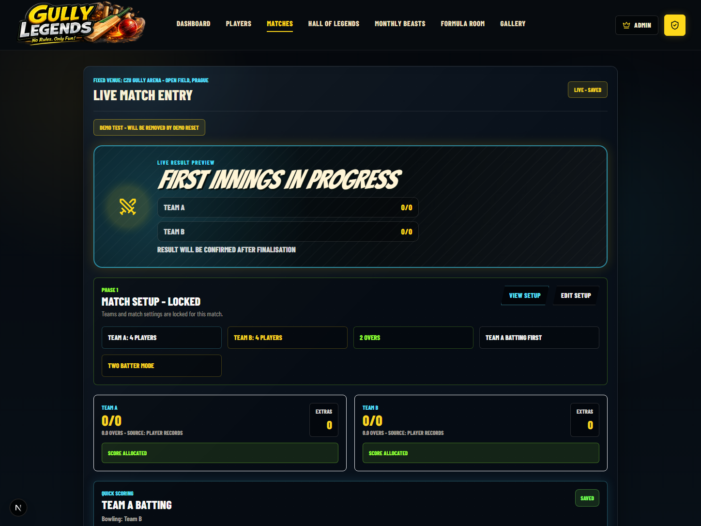

*Figure 7. Locked setup summary showing the selected Batting Mode.*

## 8. Quick Scoring Overview

Quick Scoring is the main live scoring panel. The selected Batting Mode decides which batter controls appear.

The score strip shows:

- current score;
- overs used;
- balls in the current over;
- current batter context.

### Two Batter Mode

Before scoring:

1. Select **Striker**.
2. Select **Non-striker**.
3. Select **Bowler**.
4. Record the delivery.

Striker and Non-striker must be different players. Normal odd/even strike handling applies while two batters remain, and end-of-over strike handling applies normally while two batters remain.

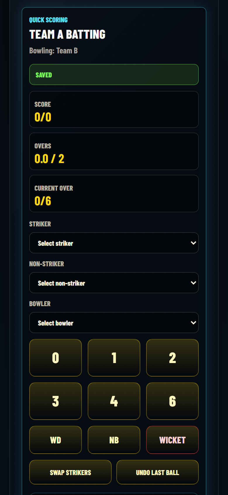

*Figure 8. Two Batter Mode uses Striker, Non-striker and Bowler controls.*

### Single Batter Mode

Before scoring:

1. Select **Batter**.
2. Select **Bowler**.
3. Record the delivery.

There is no Non-striker in Single Batter Mode. Odd runs do not change batter, the same batter remains after the end of an over, and **Swap Strikers** is not required in this mode.

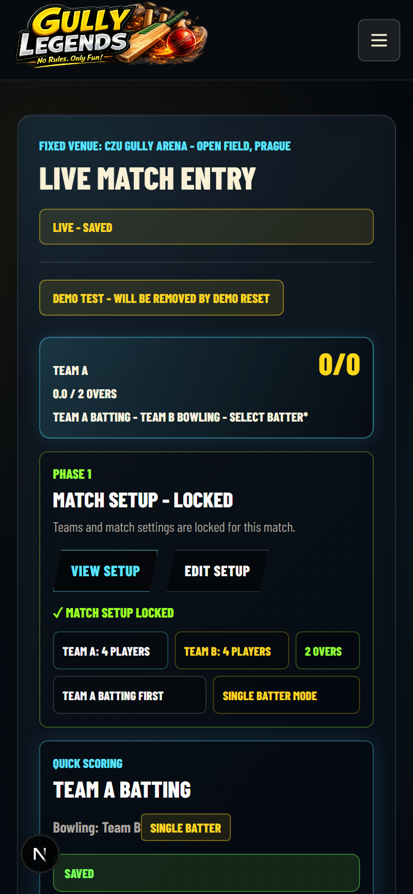

*Figure 9. Single Batter Mode shows one active Batter plus Bowler.*

## 9. Last Batter Solo

**Last Batter Solo** happens automatically in Two Batter Mode when only one undismissed player remains.

Example with a four-player batting team:

- 0 wickets: four players remain
- 1 wicket: three players remain
- 2 wickets: two players remain
- 3 wickets: one player remains and continues as Last Batter Solo
- 4 wickets: all four players are dismissed and the innings ends

For Gully Legends, the innings does **not** end simply because only one batter remains. All-out occurs when every selected batting-team player has been dismissed.

During Last Batter Solo:

- the final batter continues alone;
- Non-striker is no longer required;
- **Swap Strikers** is not needed;
- the final batter can continue scoring.

The innings can also end earlier if the scheduled overs finish, or during the second innings if the chase target is reached.

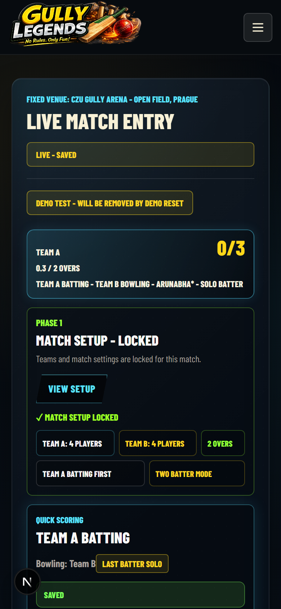

*Figure 10. Last Batter Solo appears automatically when one undismissed batter remains.*

## 10. Scoring Buttons

Use the run buttons for legal deliveries:

- **0**
- **1**
- **2**
- **3**
- **4**
- **6**

Use special buttons for:

- **WD**: wide, not a legal ball;
- **NB**: no-ball, not a legal ball, then choose batter runs;
- **WICKET**: opens dismissal details;
- **Swap Strikers**: correction control when applicable in Two Batter Mode;
- **Undo Last Ball**: removes the most recent Quick Scoring event.

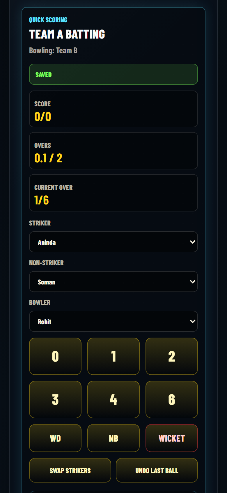

*Figure 11. Run, extra, wicket and correction buttons.*

## 11. Scoring Validation

In Two Batter Mode, the app requires a valid Striker, Non-striker and Bowler before a ball can be recorded.

In Single Batter Mode, the app requires a valid Batter and Bowler.

If a scorer tries to score without the required selections, the panel displays the required fields.

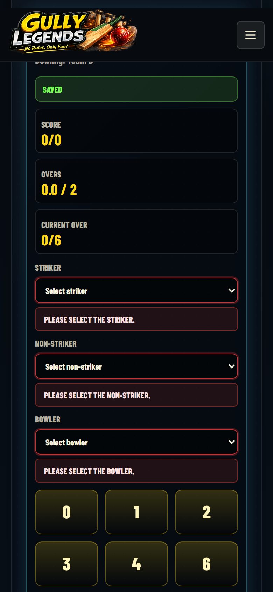

*Figure 12. Quick Scoring validation when required selections are missing.*

## 12. Wicket: Bowled

For **Bowled**, the active batter is dismissed and the bowler receives the wicket.

Two Batter Mode:

- while replacement batters remain, choose a new batter;
- when the final surviving batter is alone, no new non-striker is required;
- if the final batter is dismissed, the innings ends.

Single Batter Mode:

- choose the next batter if one remains;
- if no batter remains, the innings ends.

1. Choose **WICKET**.
2. Leave dismissal as **Bowled**.
3. Select the new batter if the innings continues.
4. Select **Record Wicket**.

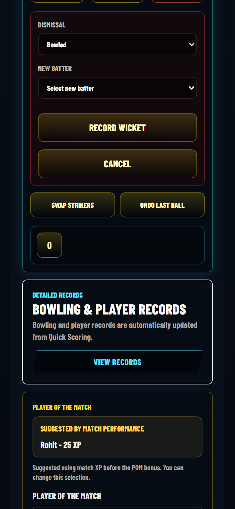

*Figure 13. Bowled wicket entry.*

## 13. Wicket: Caught

For **Caught**, select the catcher.

The app credits:

- bowler wicket to the current bowler;
- catch to the selected catcher;
- innings wicket to the batting team.

1. Choose **WICKET**.
2. Change dismissal to **Caught**.
3. Select the catcher.
4. Select the new batter if required.
5. Select **Record Wicket**.

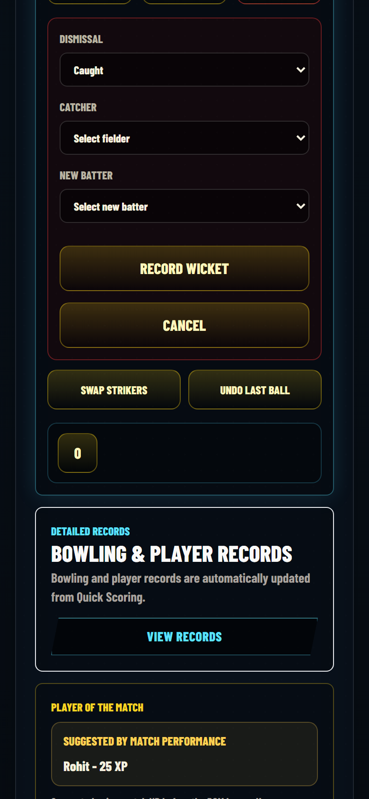

*Figure 14. Caught wicket entry with catcher selection.*

## 14. Wicket: Run Out

For **Run Out**, complete the guided steps:

1. Choose who was run out.
2. Choose runs completed before the wicket.
3. Choose the primary fielder.
4. Choose the new batter if one remains.

The system calculates the next active batter state automatically. In Single Batter Mode there is only one active batter. In Last Batter Solo, only the solo batter can be dismissed. If the final batter is dismissed, the innings ends and no new batter is requested.

Run out does **not** give a bowler wicket. It gives fielding credit to one selected fielder.

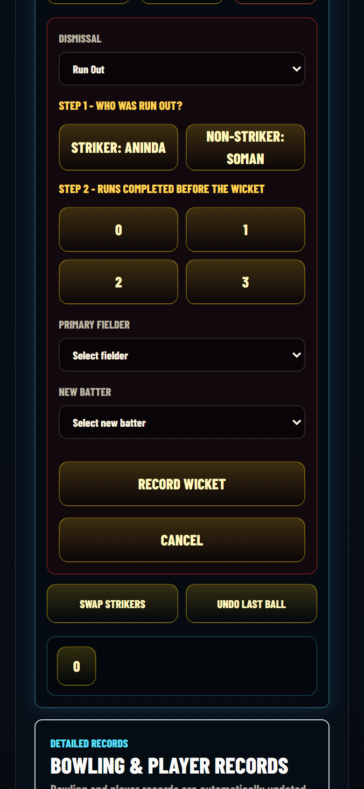

*Figure 15. Run-out workflow with one primary fielder.*

## 15. End Of Over

After six legal deliveries, the panel shows the end-of-over state. Wides and no-balls do not count as legal deliveries.

The previous over bowler cannot immediately bowl the next over.

1. Check that the current over has six legal balls.
2. Select the next eligible bowler.
3. Continue scoring the next over.

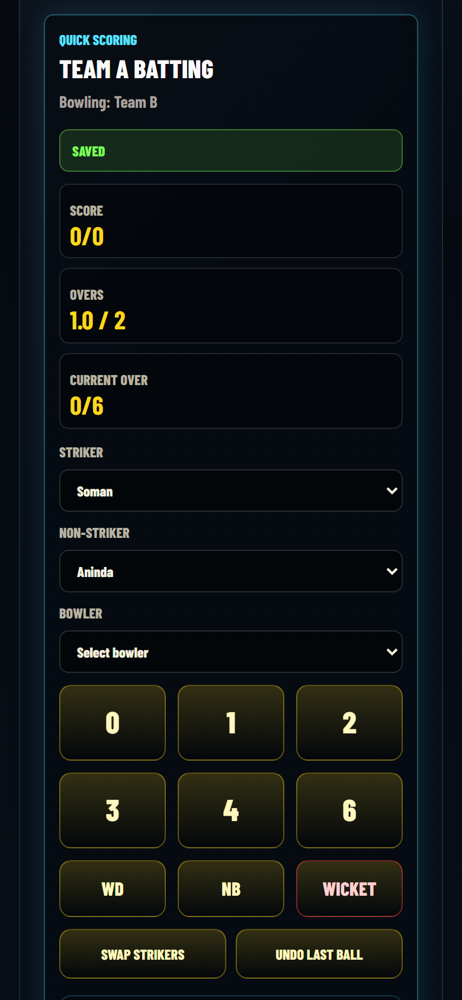

*Figure 16. End-of-over state after six legal balls.*

## 16. Undo And Current-Over Corrections

Use **Undo Last Ball** for the most recent mistake.

Undoing the final delivery of the first innings can reopen the first innings if that delivery caused innings completion. Pending wicket or no-ball entry UI is cleared after Undo. **Cancel Wicket** clears the pending wicket entry. Only committed delivery events are part of the saved scoring history.

The current-over strip also shows ball events that can be corrected to a dot ball while they are still in the current over.

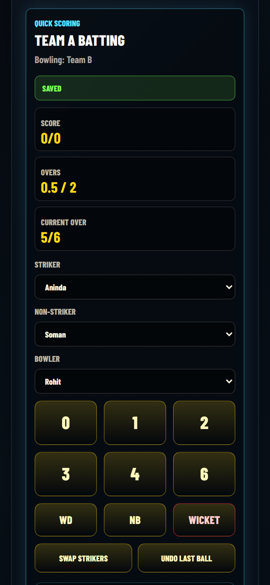

*Figure 17. Current-over correction strip and Undo Last Ball control.*

## 17. Detailed Records

Detailed Records are collapsed by default. Use **View Records** when you need to inspect or adjust the detailed bowling and player records.

The detailed records are automatically updated from Quick Scoring, including:

- Team Bowling;
- Team Player Records;
- batting order;
- did bat / did not bat;
- runs;
- wickets, catches, run outs and stumpings.

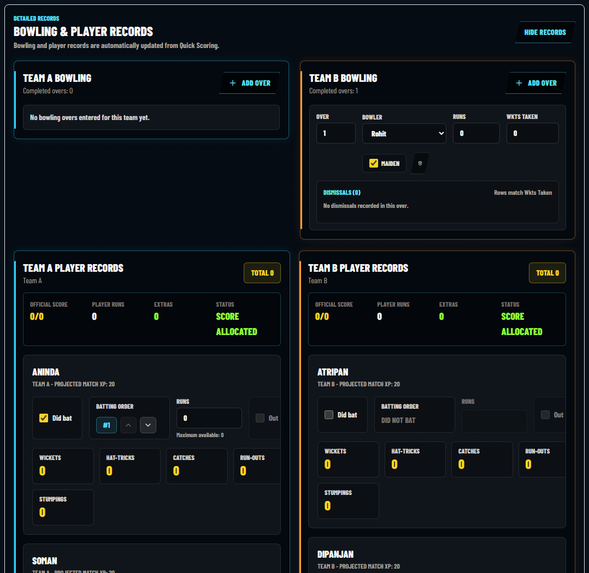

*Figure 18. Detailed Bowling & Player Records panel.*

## 18. First Innings Complete

After the first innings ends, the application stops at an explicit innings-break screen.

The screen shows:

- **FIRST INNINGS COMPLETE**
- first-innings score
- completed overs
- target
- runs Team B needs to win
- **START SECOND INNINGS**

The second innings does **not** start automatically. The Admin must select **START SECOND INNINGS** before Team B scoring begins.

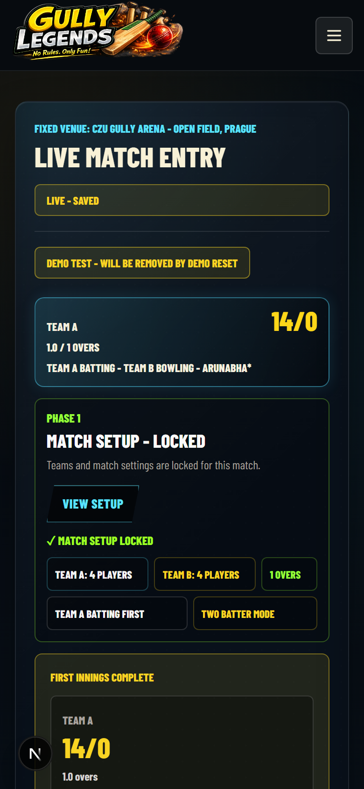

*Figure 19. First Innings Complete screen before the chase begins.*

## 19. Second Innings

Second-innings workflow:

1. First innings completes.
2. Review the innings-break summary.
3. Select **Start Second Innings**.
4. Team B becomes the batting team.
5. Team A becomes the bowling team.
6. Target is first-innings total + 1.
7. Quick Scoring follows the same Batting Mode chosen at Match Setup.

If the match uses Two Batter Mode, select Striker, Non-striker and Bowler. If the match uses Single Batter Mode, select Batter and Bowler.

*Figure 20. Second-innings Quick Scoring after Start Second Innings.*

## 20. Live Result Preview

The **Live Result Preview** is near the top of Live Match Entry so the scorer can see the match situation without scrolling to Review & Finalise.

During the first innings, it shows the current innings score and confirms the result is still in progress.

During the second innings, it shows the first-innings score, chasing score, target context and runs still needed.

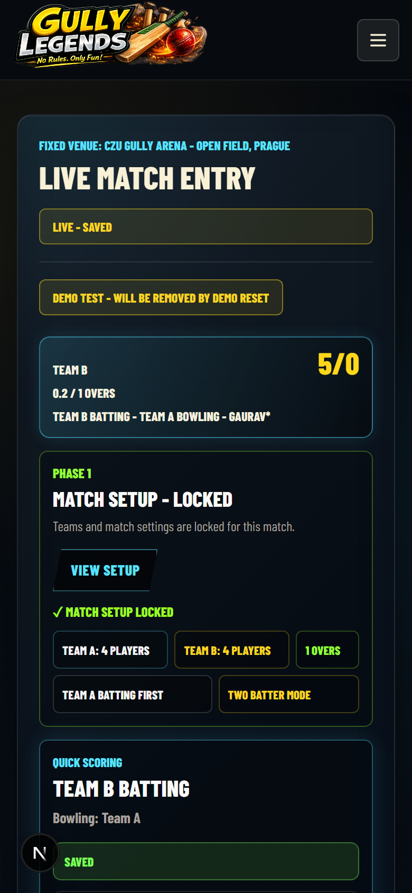

*Figure 21. Mobile second-innings match situation near the top of Live Match Entry.*

## 21. Autosave & Browser Refresh

Quick Scoring autosaves recorded match state. Watch for the **Saved** indicator.

Once a recorded delivery has been saved, refreshing or reopening the same match should restore:

- score
- wickets
- overs
- batting mode
- active batter or batters
- bowler
- innings phase
- recorded Quick Scoring events

Unfinished temporary forms are different. If the scorer merely opens **WICKET** and has not yet selected **Record Wicket**, that unfinished form does not need to be restored after refresh. Only recorded and saved scoring events are authoritative.

## 22. Admin-Only Scoring

Match scoring is Admin-only.

If the Admin logs out while a match-entry page is open:

- the match remains publicly viewable;
- scoring and edit controls become read-only;
- Admin login is required to continue scoring.

## 23. Review Before Finalisation

When the match is ready, review:

- both innings scores;
- Detailed Records;
- result preview;
- Player of the Match suggestion;
- notes, if any.

Batting Mode was already selected at Match Setup and remains part of the saved match configuration. The Admin does not select Batting Mode again during finalisation.

The result is not official until finalisation.

1. Open **Detailed Records** and check player/bowling records.
2. Check the live result preview.
3. Review the Player of the Match suggestion.
4. Select Player of the Match before finalisation.
5. Select **Finalise Match** only after both innings and result information are ready.

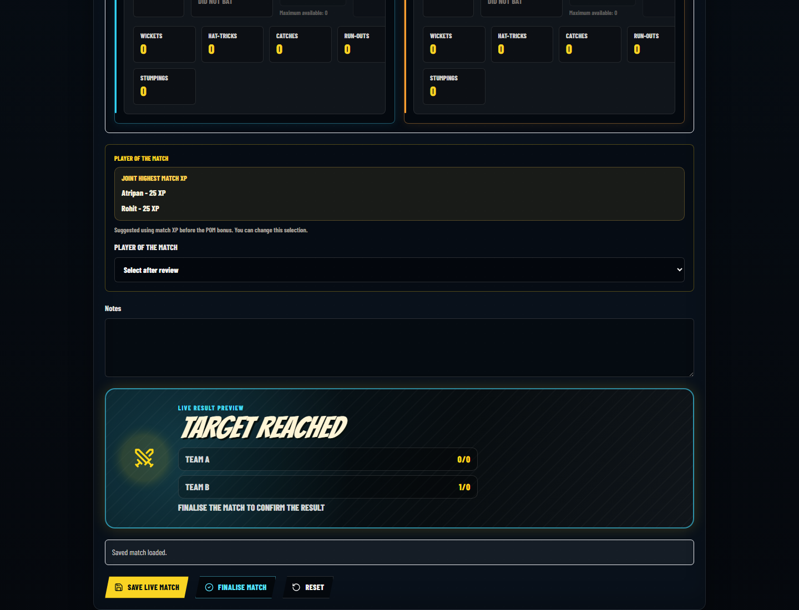

*Figure 22. Review and finalise area with records, Player of the Match, result preview and finalise controls.*

## 24. Player Of The Match

The app suggests Player of the Match from match XP before the POM bonus.

If players are tied on pre-POM XP, the app shows joint leaders and waits for the admin to decide. The admin can select a player or leave the field unselected if appropriate.

The selected Player of the Match receives the approved POM XP bonus during finalisation. Player of the Match behavior is unchanged in Version 1.1.

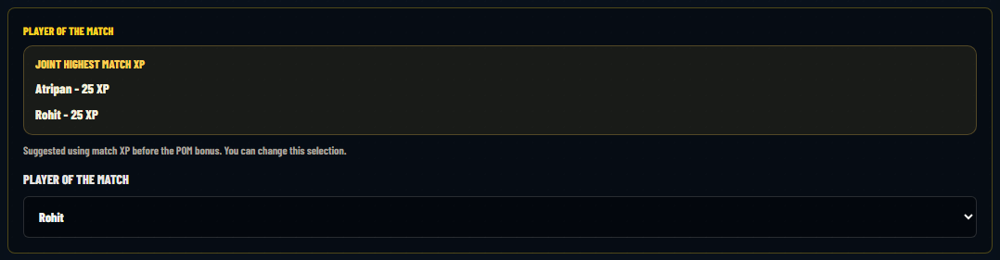

*Figure 23. Player of the Match selection after review.*

## 25. Finalised Match Scorecard

After finalisation, the page becomes a scorecard.

Editing controls are hidden. The scorecard shows:

- official result;
- innings summaries;
- batting rows;
- bowling figures;
- did-not-bat players;
- Player of the Match summary when available;
- XP awarded.

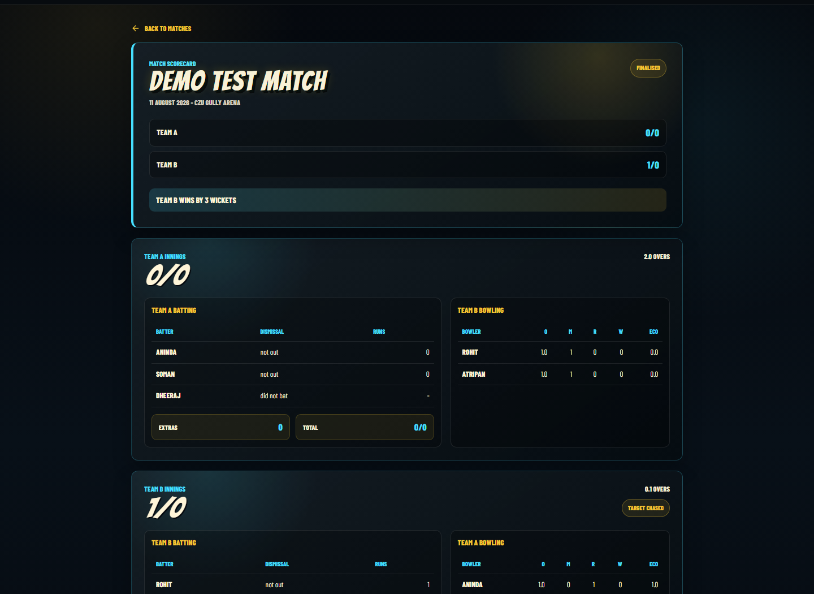

*Figure 24. Finalised match scorecard.*

## Important Scoring Rules

Selected team player means **Played = true** automatically. A selected player who never bats remains **Did Bat = false** and appears as **did not bat**.

The old separate Played checkbox is not part of the active scoring workflow.

Run out uses one primary fielder. It does not credit a bowler wicket.

LBW is not an active Quick Scoring dismissal option in the current workflow.

No Result is only for abandoned or cancelled matches. Equal completed totals are a tie.

All-out occurs when every selected batting-team player has been dismissed.

## Recommended Scorer Checklist

Before Start Match:

- confirm Available Today;
- confirm Team A and Team B;
- confirm Shared Player only if needed;
- confirm date, game number, start time, match name and overs;
- confirm who bats first;
- confirm Batting Mode.

During scoring:

- check required batter and bowler selections before every over;
- use WD and NB only for extras;
- record wicket details immediately;
- use Undo Last Ball as soon as a mistake happens;
- at first-innings completion, review the target and select **Start Second Innings**.

Before finalisation:

- open Detailed Records;
- check batting order and did-not-bat rows;
- check bowling figures;
- check result preview;
- choose Player of the Match;
- finalise only when the scorecard is ready.

## Common Problems & How to Fix Them

**Start Match will not start**  
Check the highlighted required fields, including Batting Mode.

**Cannot record a ball in Two Batter Mode**  
Select Striker, Non-striker and Bowler.

**Cannot record a ball in Single Batter Mode**  
Select Batter and Bowler.

**Why do I only see one Batter and no Non-striker?**  
The match is using Single Batter Mode.

**Why did the Non-striker disappear?**  
In Two Batter Mode, only one undismissed player remains and the match has entered Last Batter Solo.

**Why did the innings continue after the third wicket in a four-player team?**  
The final surviving player is allowed to bat alone. The innings ends when all four players are dismissed, overs finish, or the chase target is reached.

**Why did Team B not start batting automatically?**  
The first innings has ended. Review the **FIRST INNINGS COMPLETE** panel and select **Start Second Innings**.

**What happens if the browser refreshes?**  
Wait for **Saved** after recording deliveries. Saved Quick Scoring state should be restored when the match is reopened.

**Why can I view the match but not score?**  
Admin login is required for scoring and editing.

**Cannot select the same player as striker and non-striker**  
They must be different players.

**Bowled wicket will not record**  
Select the new batter if the innings continues.

**Caught wicket will not record**  
Select catcher and new batter when required.

**Run Out will not record**  
Complete all run-out steps:

1. Who was run out.
2. Runs completed.
3. Fielder.
4. New batter if required.

**Wrong delivery entered**  
Use **Undo Last Ball**.

**Wrong strike**  
Use **Swap Strikers** when applicable in Two Batter Mode.

**Cannot choose the previous bowler**  
The immediately previous over's bowler cannot normally bowl the next over.

**Setup mistake before first delivery**  
Use **Edit Setup**.

**Need to inspect detailed statistics**  
Open **Detailed Records**.

## Match-Day Quick Reference

**BATTING MODE**  
Two Batter: Striker + Non-striker + Bowler  
Single Batter: Batter + Bowler

**LAST BATTER SOLO**  
In Two Batter Mode, the final undismissed player continues alone.

**NORMAL RUNS**  
0 | 1 | 2 | 3 | 4 | 6

**EXTRAS**  
WD = Wide  
NB = No-ball

**WICKET**  
Choose **WICKET** and complete required dismissal information.

**RUN OUT**  
Who was out -> Runs completed -> Fielder -> New batter if required

**WRONG BALL**  
**Undo Last Ball**

**WRONG STRIKE**  
**Swap Strikers** when applicable in Two Batter Mode

**FIRST INNINGS COMPLETE**  
Review target -> Start Second Innings

**END OF OVER**  
Select the next eligible bowler.
